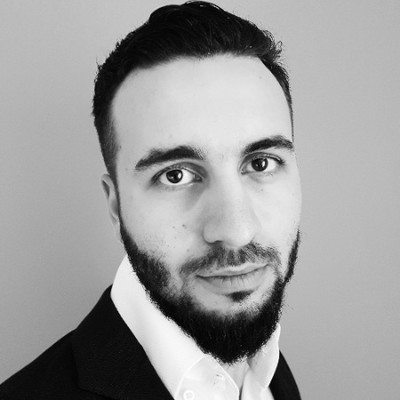

## Technical Lead / Architect  
### **Timur Isachenko**

#### Contact Information:
- **Phone:** +38267584213
- **Email:** [isatimur.it@gmail.com](mailto:isatimur.it@gmail.com)
- **LinkedIn:** [linkedin.com/in/timur-isachenko](https://www.linkedin.com/in/timur-isachenko/)

#### Professional Profile:
Distinguished Technical Lead and Architect with extensive experience in developing high-load systems within finance, healthcare, and online banking sectors. Renowned for leading diverse teams, designing sophisticated architectural solutions, and delivering trailblazing technology projects. Adept at navigating complex technical challenges, with a deep commitment to driving digital innovation.

#### Professional Experience:

**Technical Leader / Project Architect**  
_IDS, Moscow, Russia_  
_November 2022 - Present_
- Spearheaded the design and implementation of a billing system for betting and gambling platforms using Kotlin, Spring Cloud API Gateway, MongoDB, and Kubernetes.

**Technical Lead**  
_EastBanc Technologies_  
_May 2022 - July 2023_
- Led the technical development of a grant system for California's healthcare sector, with potential for national scalability.
- Managed various projects, including payment system migration from Cybersource to Braintree Paypal for Redcross, and developing a notification service for Glorifi Bank.

**Senior Java Team Leader / Enterprise Architect**  
_Business Environment, Moscow, Russia_  
_September 2017 - June 2022_
- Orchestrated the development of an educational platform on a microservices architecture using Play Framework, MyBatis, and Postgres.
- Headed a team of 20, implementing numerous system integrations, including payment solutions and webhooks.

**Senior Developer / Fullstack Developer**  
_AT-Consulting, Moscow, Russia_  
_September 2014 - September 2017_
- Key contributor to the Sberbank.ru redevelopment on the BackBase platform, integrating React widgets with Java backend.
- Resolved critical challenges in the UC2GET project, demonstrating full-stack development expertise.
- Participated in pre-sale projects for Gazprom's Media Archive and Altynbank, along with video verification projects incorporating Apache Cordova, PayPal SDK, and WebRTC.

**QA Engineer / CGS Duty Manager**  
_ATOS, Sochi, Russia_  
_2012 - 2014_
- Enhanced problem-solving skills during the Sochi 2014 Olympics operations.
- Awarded two silver medals in the Accolade Awards for process improvement and automation.
- Managed third-level support, change management, incident management, and system administration.

**Java Developer / Specialist**  
_Kuban Energo, Krasnodar, Russia_  
_2009 - 2012_
- Began as a Junior Java Developer, advancing to Senior Specialist.
- Engaged in projects involving XSLT, XML, Java, and PHP.
- Selected for the "Golden 100" HR reserve program at MRSK Holding, demonstrating elite potential.

#### Education and Certifications:
- Specialist Degree in Computer Science and Applied Mathematics, Kuban State University (KubSU), 2005-2010
- Oracle Certified Java Associate, Java SE 8
- Oracle Certified Java Professional, Java SE 8

#### Additional Experience and Achievements:
- Co-authored "High Performance In-Memory Data Grid with Ignite."
- Conducted Java courses and presented on multi-tenancy at local conferences.
- Appeared on television for professional insights and participation in running events.

#### Skills:
- Leadership in Technical Projects
- Architectural Planning and Microservices Design
- Full-Stack Development (Java, Kotlin, React)
- System Integration and Complex Problem-Solving
- Effective Communication and Public Speaking
